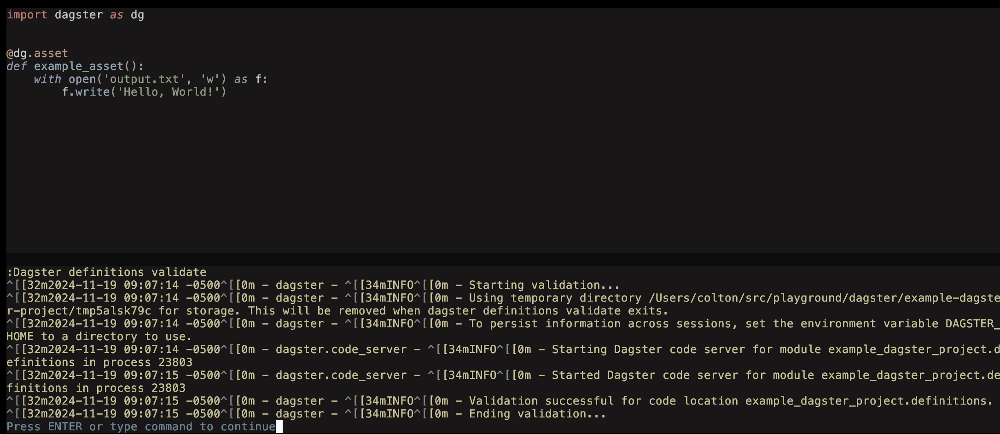
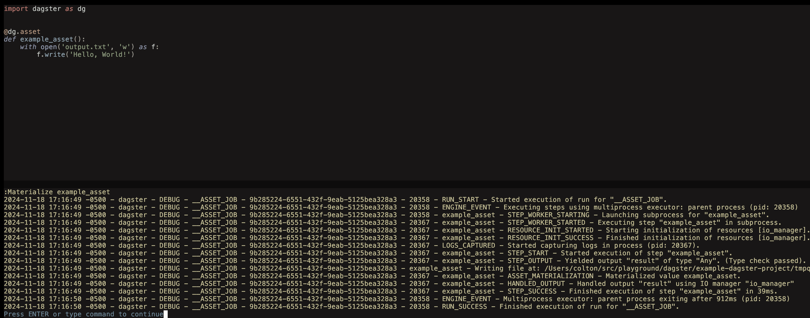

> [!WARNING]
> This project is under active development and is subject to change!

<div align="center">
    
    <br>
    <p>
        <i>Control <a href="https://dagster.io">Dagster</a> directly from Neovim.</i>
    </p>
</div>

# dagster.nvim

## Setup

Using [lazy.nvim](https://github.com/folke/lazy.nvim):

```lua
{
  "cmpadden/dagster.nvim",
  config = function()
    require('dagster').setup()
  end
}
```


## Usage

### `:Dagster [ARGS]...`

Any `dagster` can be run through the `:Dagster` command. For example, see an example of running `dagster definitions validate` in the screenshot below.



### `:Materialize <SELECT>`

Assets can be materialized by using the `:Materialize` user command and supplying a selector string.


